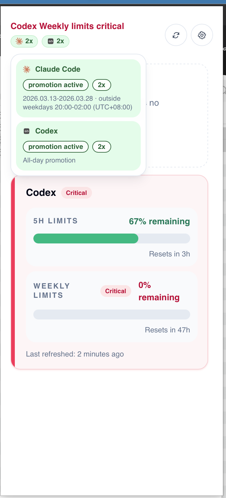
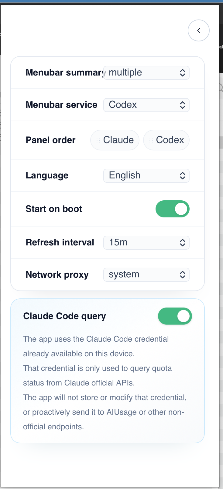

# AIUsage

AIUsage shows Codex and Claude Code quotas in your tray or menu bar.
It supports macOS (tested) and Windows (not yet tested; testing is welcome).

## Features

- Check Codex and Claude Code quota status from one desktop panel
- Quickly check quotas and promotions for supported services
- Review remaining quota, reset timing, and severity at a glance
- Keep the app in the tray or menu bar instead of a full desktop window
- Refresh service status on demand
- Customize tray summary behavior, panel order, language, autostart, refresh interval, and proxy settings
- See clear disconnected or missing-session states when a service is unavailable

## Screenshots

<table>
  <tr>
    <td align="center" colspan="2">
      <strong>Menu bar</strong>
      <br />
      
    </td>
  </tr>
  <tr>
    <td align="center">
      <strong>Quota panel</strong>
    </td>
    <td align="center">
      <strong>Settings</strong>
    </td>
  </tr>
  <tr>
    <td align="center">
      
    </td>
    <td align="center">
      
    </td>
  </tr>
</table>

## Get the App

Download the package for your platform from the [GitHub Releases page](https://github.com/theggs/ai-usage/releases).

macOS:

1. Download the latest `AIUsage_*_macos.zip` file.
2. Unzip the file to get `AIUsage.app`.
3. Move `AIUsage.app` to `/Applications`.
4. Open `AIUsage.app`.

Because the current macOS app is not signed, macOS may block it from opening. If that happens, remove the quarantine attribute:

```bash
sudo xattr -d com.apple.quarantine "/Applications/AIUsage.app"
```

Windows:

1. Download the latest Windows `.exe` installer.
2. Run the installer.
3. Launch `AIUsage` from the Start menu or installed location.

## Usage

- Open the tray or menu bar panel to inspect the current service status
- Review remaining quota, reset timing, and severity for each supported service
- Open Settings to adjust tray summary behavior, service order, language, autostart, refresh interval, and proxy settings
- Refresh the panel when you want to sync with the latest local CLI state

For live data, make sure the relevant local CLI is installed and already signed in on your machine.

## Claude Code Query Notice

AIUsage reads the Claude Code credential already available on your device and uses it only to query quota status from Claude official APIs.

AIUsage will not store, modify, or manage that credential, or proactively send it to AIUsage services or other non-official endpoints.

Some regions may require a network proxy to retrieve Claude Code quota information. The app automatically detects and uses available proxy settings.

## Development

Build from source only if you want to contribute, test, or run the project locally during development.

Requirements:

- Node.js 24 LTS (`.nvmrc` is set to `24`)
- Rust stable toolchain
- A local Codex CLI installation with an active `codex login` session
- Tauri desktop build prerequisites for your platform

Project structure:

```text
src/                          React frontend
src-tauri/                    Rust backend and Tauri shell
tests/                        E2E and integration tests
screenshots/                  UI reference screenshots
doc/                          Engineering notes and maintenance guides
specs/                        Feature specs and planning artifacts
```

Documentation notes:

- Promotion campaign maintenance is documented in [doc/promotion-update-guide.md](./doc/promotion-update-guide.md)

Useful commands:

```bash
nvm install
nvm use
npm install
npm run dev           # Vite frontend
npm run tauri:dev     # Tauri desktop app
npm run tauri:dev:onboarding  # Tauri app in first-run onboarding mode
npm run build         # Frontend production build
npm run tauri:build   # Desktop production build
```

## Architecture Notes

- Codex data is read from the local logged-in Codex CLI session.
- Claude Code data depends on local Claude Code credentials being available on the machine.
- Promotion campaign maintenance is documented in [doc/promotion-update-guide.md](./doc/promotion-update-guide.md).
- The frontend renders normalized payloads returned by the host layer rather than parsing raw CLI output directly.
- The host prefers `codex app-server` plus `account/rateLimits/read` for live Codex limits.
- `AI_USAGE_CODEX_STATUS_TEXT` and `AI_USAGE_CODEX_STATUS_FILE` exist only as test or debug fallbacks.

## Development Workflow

Each feature is developed through a spec-driven workflow managed by
[Spec Kit](https://github.com/github/spec-kit). The process runs in order:

1. **Constitution** — governing principles in `.specify/memory/constitution.md`
   define non-negotiable boundaries for security, contracts, testing, and
   truthful state handling. Every feature plan is checked against these before
   implementation starts.
2. **Spec** — user scenarios, acceptance criteria, and edge cases written before
   any code is touched.
3. **Contract** — host-to-UI command boundaries, payload shapes, and error
   contracts defined per feature so layers stay decoupled.
4. **Plan** — technical approach and architecture decisions, including an
   explicit constitution check.
5. **Tasks** — implementation broken into steps small enough for an AI coding
   agent to execute without losing context.
6. **Implement** — code written against the spec and contract, followed by
   real-runtime verification for any UI or tray behavior.

Planning artifacts for each feature live in `specs/<feature-id>/`. The
constitution and workflow constraints are the primary mechanism for keeping
AI-generated output consistent across sessions and models.

## Testing

Run the main validation commands:

```bash
npm test
npm run lint
npm run test:e2e
cargo test --manifest-path src-tauri/Cargo.toml
npm run tauri:build
```

Additional desktop verification commands:

```bash
npm run test:e2e:tauri
npm run test:e2e:screenshots
npm run verify:build-stability ./artifacts/build-metadata/*.json
```

The screenshot and Tauri-specific end-to-end checks are especially important for UI or tray behavior because desktop interaction details cannot be validated by JSDOM alone.

## Troubleshooting

- If Codex data is unavailable, run `codex login` again in your shell.
- If Claude Code data is unavailable, verify that Claude Code is installed and signed in on the machine.
- If `npm run tauri:dev` fails on a fresh machine, verify the native prerequisites required by Tauri for your operating system.

## Contributing

Contributions are welcome. For substantial changes, open an issue first so the implementation approach can be aligned before work starts.

Before submitting a pull request:

- Run the relevant test commands from the `Testing` section
- Keep commit messages in the `type: lowercase description` format
- Preserve real-runtime verification for desktop UI changes instead of relying only on unit tests

## License

This project is licensed under the Apache License 2.0. See [LICENSE](./LICENSE) for details.
