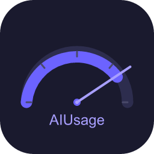

<p align="center">
  
</p>

<h1 align="center">AIUsage</h1>

<p align="center">
  Know if your AI coding quota will last — without opening the app.
</p>

<p align="center">
  <a href="https://github.com/anthropics/ai-usage/releases/latest"></a>
  <a href="LICENSE"></a>
</p>

<p align="center">
  <a href="README.zh-CN.md">简体中文</a> | English
</p>

---

AIUsage is a **menubar desktop app** for macOS and Windows that tracks AI coding assistant usage quotas in real time. Glance at the menubar to see how much quota you have left across all providers — no context switching needed.

<p align="center">
  
</p>

## Features

**Multi-provider quota tracking** — Monitor usage across Claude Code, Codex, Kimi Code, and GLM Coding Plan from one panel.

<table>
  <tr>
    <td align="center"><strong>Quota panel</strong></td>
    <td align="center"><strong>Settings</strong></td>
  </tr>
  <tr>
    <td align="center">
      
    </td>
    <td align="center">
      
    </td>
  </tr>
</table>

**Burn-rate forecasting** — See whether your current usage pace will exhaust the quota before it resets. Warnings appear only when the pace is risky.

**Smart severity alerts** — Quota health is classified by both remaining percentage and burn rate. The tray icon color reflects the most urgent provider.

**Auto menubar service** — Detects which coding assistant you're actively using and highlights its quota in the menubar automatically.

**Configurable & localized** — Refresh interval, panel order, proxy settings, language (English / 中文), and per-provider toggles — all from the settings panel.

## Install

Download the latest release for your platform from the [GitHub Releases](https://github.com/anthropics/ai-usage/releases) page.

| Platform | Asset | Instructions |
|----------|-------|--------------|
| macOS    | `AIUsage_<version>_macos.zip` | Extract and move `AIUsage.app` to `/Applications` |
| Windows  | `AIUsage_<version>_x64-setup.exe` | Run the installer |

> **macOS note:** The app is not yet code-signed. If macOS blocks it, run:
> ```bash
> sudo xattr -d com.apple.quarantine "/Applications/AIUsage.app"
> ```

## Getting Started

1. **Launch AIUsage** — it lives in your menubar (no dock icon).
2. **Enable providers** in Settings — toggle the services you use.
3. **Authenticate** each provider via its standard method:
   - **Codex** — run `codex login` in your terminal
   - **Claude Code** — credentials are read from macOS Keychain or `~/.claude/.credentials.json`
   - **Kimi Code / GLM Coding Plan** — enter your API token in Settings
4. **Done** — quota cards auto-refresh on your chosen interval (default 15 min).

## Claude Code Query Notice

AIUsage reads the Claude Code credential already on your device to query quota status from Claude official APIs only. It will **not** store, modify, or forward that credential to any non-official endpoint.

> **Note:** According to Anthropic Consumer Terms of Service (sections 3.3, 3.7), accessing Claude Code rate limit information via third-party software may risk account action. Claude Code is **disabled by default** — enable it only if you accept this risk.

Some regions may require a network proxy. The app auto-detects system proxy settings.

## Build from Source

Requires: Node.js 24+, Rust stable, platform build tools (Xcode CLI on macOS, Visual Studio Build Tools on Windows).

```bash
git clone https://github.com/anthropics/ai-usage.git
cd ai-usage
npm ci
npm run tauri:dev    # development
npm run tauri:build  # production
```

<details>
<summary>Project structure</summary>

```text
src/              React frontend (views, components, features)
src-tauri/        Rust backend (commands, state, tray, providers)
tests/            E2E and integration tests
screenshots/      UI reference screenshots
doc/              Engineering notes
```

</details>

<details>
<summary>Testing</summary>

```bash
npm test                                    # Vitest unit tests
npm run lint                                # TypeScript type check
cargo test --manifest-path src-tauri/Cargo.toml  # Rust tests
npm run test:e2e                            # Playwright E2E
npm run tauri:build                         # Full production build
```

</details>

## Contributing

Contributions are welcome. For substantial changes, open an issue first to align on the approach.

- Run tests before submitting a PR
- Follow `type: lowercase description` commit format
- Preserve real-runtime verification for desktop UI changes

## Changelog

See [CHANGELOG.md](CHANGELOG.md) for release history.

## License

[Apache-2.0](LICENSE)
